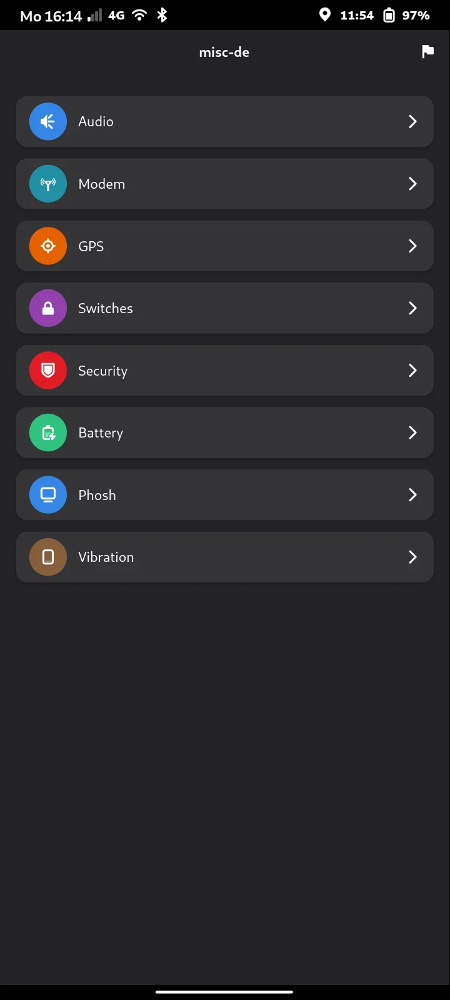
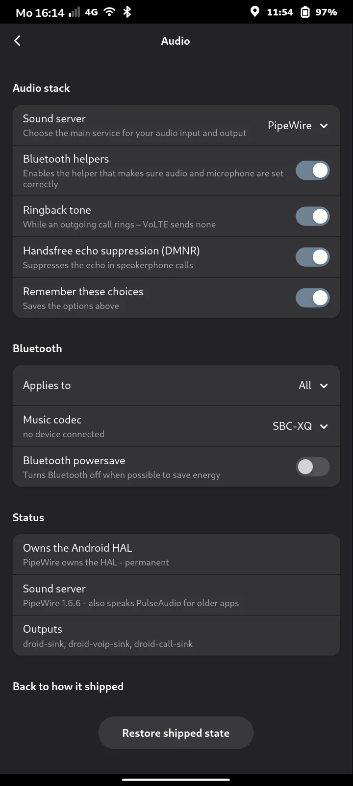
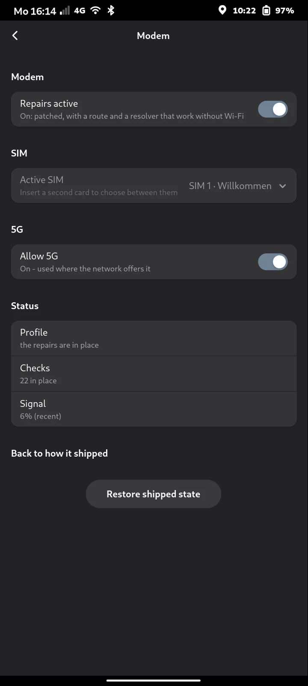
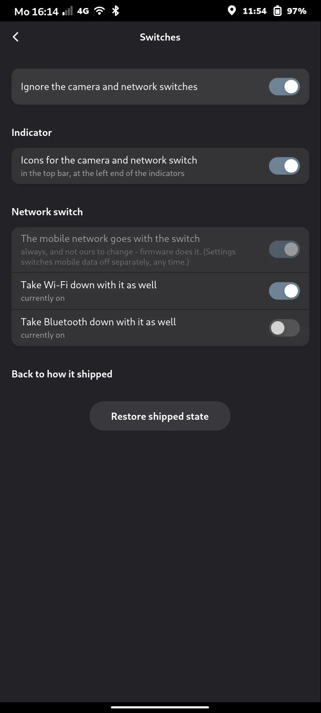
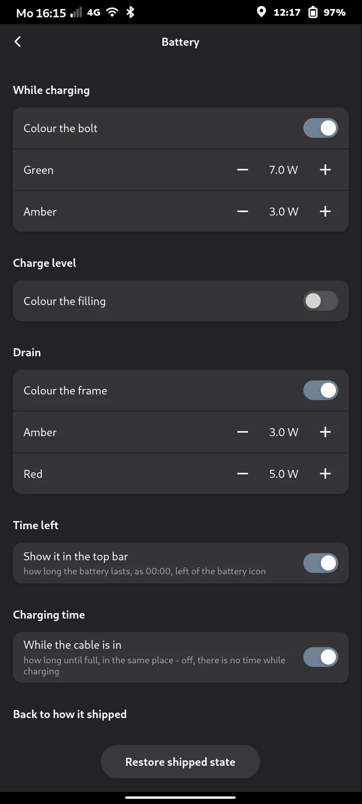
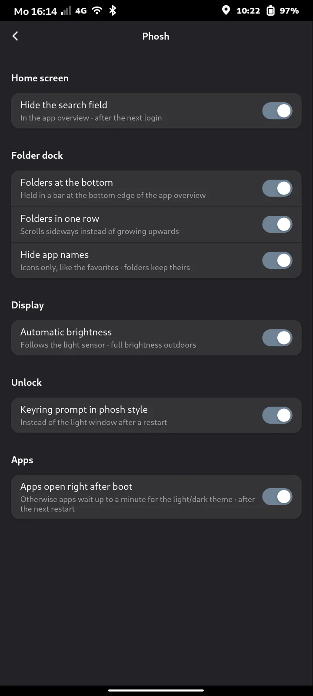
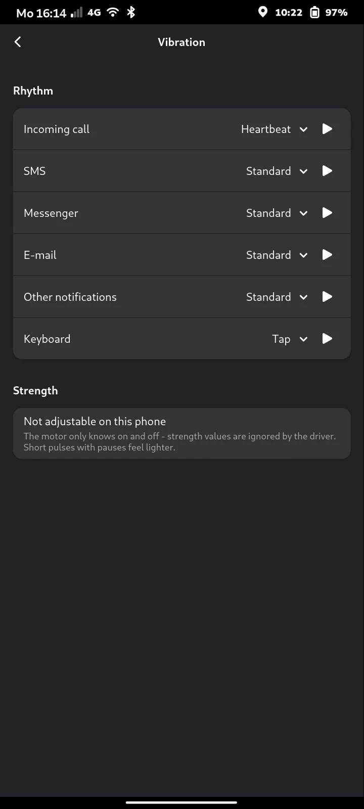

# misc-de

A GTK4/libadwaita app for the FuriPhone FLX1 that shows and switches what has
been repaired on this phone by hand: audio, modem, location, the three
hardware switches on the case, and what the battery icon is allowed to say
(the bolt the charging power, the frame the drain, the filling the charge
level, and the time left beside it).

It repairs nothing itself. It drives the tools that do, reads their state, and
says what a decision costs.

| Tab | Tool | Repository |
|---|---|---|
| Audio | `audioctl` | [furios_audio](https://github.com/misc-de/furios_audio) |
| Modem | `modemctl` | [furios_modem_fixes](https://github.com/misc-de/furios_modem_fixes) |
| GPS | `furios-gps-contribute` | [furios_gps](https://github.com/misc-de/furios_gps) |
| Switches | `killswitch-indicator` | [furios_killswitch](https://github.com/misc-de/furios_killswitch) |
| Battery | `battctl` | [furios_misc/battery](https://github.com/misc-de/furios_misc) |

None of them has to be installed. A tab whose tool is missing is still there
and offers to fetch and install it for you; once that finishes, the tab becomes
the real one without a restart.

When something newer is waiting - for one of the tools or for the app itself -
a count appears in the top left of the header bar. Pressing it lists what would
be taken and asks once: one password for all of them, and the app restarts when
they are in. With nothing waiting there is no button at all.

## Screenshots

  
  
  
  

  
  
  

## Install

Fetch the repository, then run the installer from inside it:

    git clone https://github.com/misc-de/furios_app
    cd furios_app && ./install.sh

Not with `sudo` in front - the installer asks for it where it needs it, which
is only the three lines that write to `/usr/local`.

Puts `misc-de` in `/usr/local/bin`, the `miscde` package it starts in
`/usr/local/lib/misc-de`, and the icon and launcher entry beside them. It then
appears in the app grid, or starts with `misc-de`. From the clone, `./misc-de.py`
runs what is checked out rather than what is installed.

`./uninstall.sh` takes those three away again, together with everything the
window wrote (its language, the Phosh tab's switches, the keyring prompter
shim) and its own clones in `~/.local/share/misc-de/` - a clone with
uncommitted or unpushed work in it is named and kept, and so is one whose
tool is still installed, since its `uninstall.sh` is the only copy on the
phone: run that first, then `./uninstall.sh` again. Afterwards a new
install behaves as on a new phone. It leaves the tools behind the tabs where
they are and says so: each tool was its own decision and has its own
uninstaller, and two of them hold this phone's sound and its data connection.

Nothing is put back from a guess. Before its first change, every switch
that writes something - the Phosh tab's files and phosh's plugin list,
batman's `BTSAVE`, the colouring daemon's unit - writes down what was there:
a file's text or that there was none, a dconf key's value or that it was
unset, the config lines as they were. The records live in
`~/.config/misc-de/original/`, one small JSON file each, and are written
once: a second toggle or a reinstall keeps the first original.
`install.sh` does the same for the shared directories and caches under
`/usr/local`, in `/usr/local/lib/misc-de/original-state`. Switching off and
`./uninstall.sh` put back exactly that - but only while it is still as the
app left it; changed by somebody since, it is left alone and named. Where
there is no record (an older version made the change), the uninstaller
falls back to removing what carries the app's markers and says so.

Keep the clone: the app updates itself out of it, and the icon in the header
bar offers the next version when there is one. The five tools behind the tabs
are fetched the same way, into `~/.local/share/misc-de/`.

Requires `python3-gi` and `gir1.2-adw-1`, and nothing else.

## What each tab does

**Audio** — who owns the Android audio HAL, whether that survives a reboot, and
the dual-microphone echo cancellation for calls. Under Bluetooth: the music
codec for headsets - automatic, or AAC, SBC-XQ, SBC (40 % less CPU than AAC,
audibly worse), aptX, aptX HD, LDAC - with what the connected headset plays.

**Modem** — the repairs to ofono2mm and ModemManager on or off, remembered or
only until the next boot, what the checks say, and how good the signal is.

**GPS** — sending the Wi-Fi networks around you, with a satellite position, to
beaconDB, so Wi-Fi location works where it does not yet. Off until switched
on; the row says what leaves the phone before anybody touches it. The location
filter this page used to switch is retired: geoclue refuses IP-derived
positions itself since 2.7.1-3+furios7.

**Switches** — what the three sliders on the case took down with them. Camera
and cellular are software shutdowns; the microphone switch physically cuts the
line and is therefore invisible to software, which the page states rather than
guessing at. No slider position is shown: the hand on the case already decided
it, and repeating it back is a reading without a use.

**Battery** — five options, each in a box of its own: colour while charging
(the bolt), colour by charge level (the filling), colour an unusual drain (the
frame), and the two that put a time beside the battery icon - how long the
battery lasts, and how long until it is full. The thresholds are set with
- and +, one step per tap, and shown under the switch they belong to when it
is on. They were sliders, and scrolling the page with a finger moved them.

**Phosh** — the look of phosh's app overview, written by the app itself as
you. Four switches:

- *Hide the search field* adds a marked block to `~/.config/gtk-3.0/gtk.css`
  and takes exactly that block out again; anything else in the file stays.
  phosh reads the file once at start, so it shows after the next login.
- *Folders at the bottom* holds the folders in a bar at the bottom edge,
  over the apps, which scroll underneath it blurred. It needs the
  folder-dock plugin from furios_phosh and puts its name into phosh's
  list of status icons; phosh follows that list at once.
- *Folders in one row* puts every folder on one line that scrolls sideways.
- *Hide app names* shows the apps as icons only, the way phosh shows its
  favorites. Folders keep their names, and so do the apps inside a folder.

The last two are keys in `~/.config/furios-folder-dock.conf`, which the plugin
watches, so they take effect at once. They need the folders at the bottom
switched on.

*Keyring prompt in phosh style* (group *Unlock*): after a restart
gnome-keyring asks for its password before phosh has registered its own
prompt, so D-Bus starts the plain GTK 3 `gcr-prompter` - light, whatever the
theme. The switch writes `~/.local/share/dbus-1/services/org.gnome.keyring.SystemPrompter.service`
and a shim in `~/.local/libexec` that waits up to 90 s for phosh's prompt and
only then falls back to `gcr-prompter`, dark when the phone is. Off removes
both files, and only when they are ours. Nothing under `/usr` is touched.

Every page has the same plainly labelled way back to how the phone shipped, and
asks before it does anything.

## How it is laid out

    misc-de.py          what /usr/local/bin/misc-de is: finds the package, starts it
    miscde/
      window.py         the frame, the tabs, and what every page shares
      pages/            one module per tab, plus the installer behind a missing one
      components.py     the five tools, and the steps that fetch one
      askpass.py        how sudo asks for a password with no terminal
      process.py        running a helper without freezing the window
      tools.py          finding the programs, and fingerprinting this one
      words.py          turning what a tool prints into what a row says

`Window` is assembled from the page modules rather than holding them: they are
mixins, because what they share is `self` - `self.live` to know whether a tool
is there, `self.set_busy` to lock the window while a helper runs. Which module
a method belongs in is decided by the page it speaks for.

## Tests

    tests/run-tests.sh      # no display, no root, no phone in hand
    tests/coverage.sh       # line coverage

The window is built, filled and clicked against a stand-in for PyGObject, so
this runs over ssh. What it cannot check is what a person sees — whether the
text fits 360 logical pixels, whether a tap lands where it looks. That is read
off the phone.

## Licence

MIT — see [LICENSE](LICENSE). **What the app installs is not MIT:** the audio
package is LGPL-2.1 and the modem package GPL-2.0, because of what they build
on. [NOTICE](NOTICE) lists every component with its licence.

Why the app is built this way is in [FINDINGS.md](FINDINGS.md).
